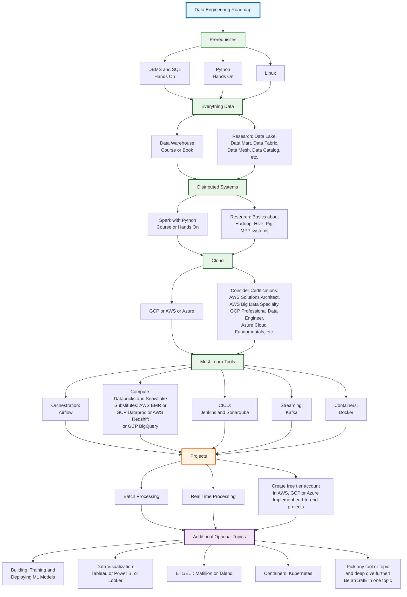

# Data Engineering Roadmap

This roadmap visualizes the complete learning path for data engineering, from prerequisites through core tools and projects.
[This diagram is based on the Data Engineering Roadmap by Jash Radia](index.pdf)

## Roadmap Diagram

## Key Components

### 1. Prerequisites
- **DBMS and SQL**: Hands-on experience required
- **Python**: Hands-on experience required
- **Linux**: Fundamental knowledge

### 2. Everything Data
- **Data Warehouse**: Learn through courses and books
- **Research**: Data Lake, Data Mart, Data Fabric, Data Mesh, Data Catalog, etc.

### 3. Distributed Systems
- **Spark with Python**: Course and hands-on practice
- **Research**: Basics about Hadoop, Hive, Pig, MPP systems

### 4. Cloud
- **Platforms**: GCP, AWS, or Azure
- **Certifications**: Consider AWS Solutions Architect, AWS Big Data Specialty, GCP Professional Data Engineer, Azure Cloud Fundamentals, etc.

### 5. Must Learn Tools
- **Orchestration**: Airflow
- **Compute**: Databricks and Snowflake (Substitutes: AWS EMR or GCP Dataproc | AWS Redshift or GCP BigQuery)
- **CICD**: Jenkins and Sonarqube
- **Streaming**: Kafka
- **Containers**: Docker

### 6. Projects
- **Batch Processing**: Process large volumes of data in batches
- **Real Time Processing**: Master streaming data processing
- **Cloud Practice**: Create a free tier account in AWS, GCP, or Azure and implement end-to-end projects

### 7. Additional Optional Topics
- **ML Models**: Building, training, and deploying machine learning models
- **Data Visualization**: Tableau, Power BI, or Looker
- **ETL/ELT Tools**: Matillion or Talend
- **Containers**: Kubernetes
- **Specialization**: Pick any tool or topic and deep dive further to become a Subject Matter Expert (SME)
